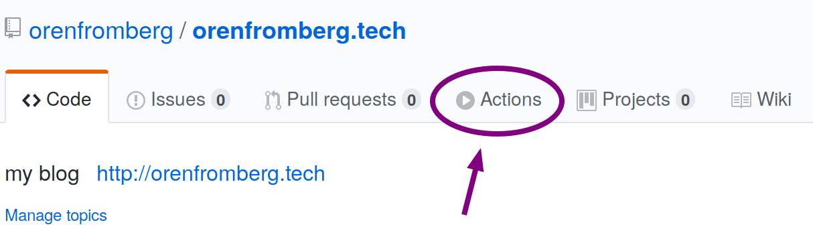
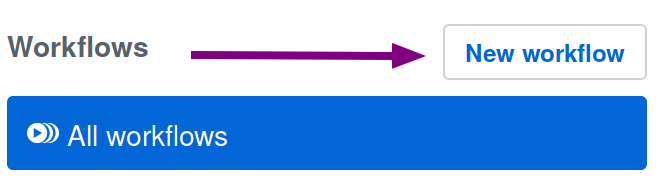
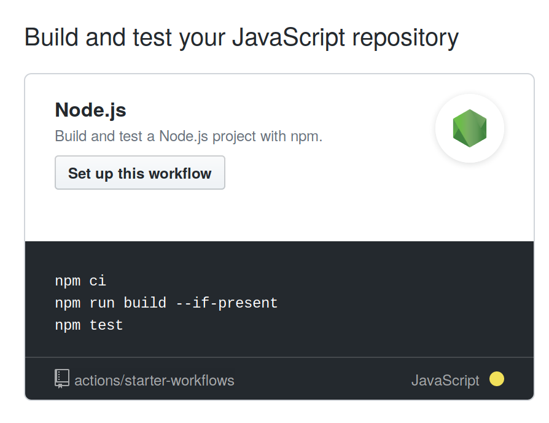
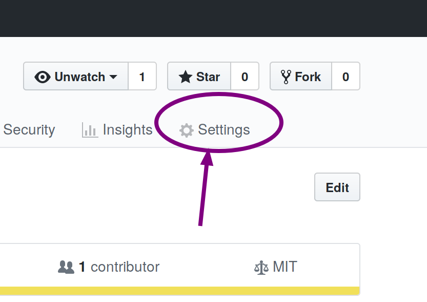
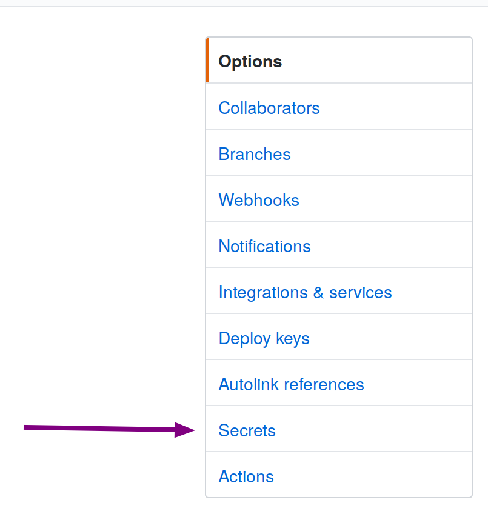
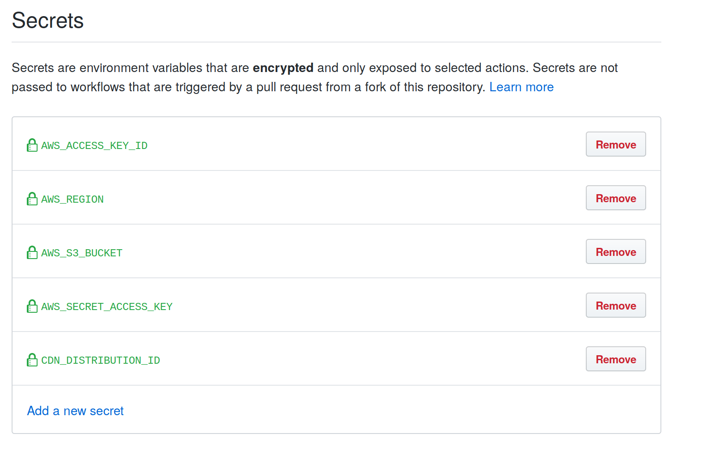
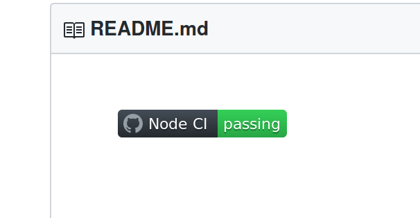

## Getting Started

On November 13th, GitHub will ship a new feature called Actions -- tight automation integrations that are available to all GitHub repositories, and
can automate many software workflows.

I decided to try using Actions to build, test and deploy my blog. The
first step was adding a workflow, which was pretty simple since it was already
available as a starter workflow for Node.js apps. To do this, I clicked on the
"Actions" tab on my repository page:



Then I clicked the "New Workflow" button:



Because my blog is a Node.js project, the first starter workflow it showed was
exactly the one I needed for building and testing the code:



This starter created a file in my repo called `.github/workflows/nodejs.yml`. I
adjusted some things like the versions of `Node.js` in the `node-version`
strategy matrix, as well as the condition that the workflow would execute under (on push to the master branch):

```yaml
name: Node CI

on:
  push:
    branches:
      - master

jobs:
  build:
    runs-on: ubuntu-latest
    strategy:
      matrix:
        node-version: [10.x]
    steps:
      - uses: workflows/checkout@v1
      - name: Use Node.js ${{ matrix.node-version }}
        uses: workflows/setup-node@v1
        with:
          node-version: ${{ matrix.node-version }}
      - name: npm install, build, and test
        run: |
          npm ci
          npm run build --if-present
          npm test
        env:
          CI: true
```

## Adding the Action for deploying with AWS

I use AWS to host and distribute my blog. Fortunately, there is a GitHub Action for that [here](https://github.com/workflows/aws/).

These actions would be responsible for syncing the build with the s3 bucket that hosts the static content as well as invalidating the CDN cache on Cloudfront. To do this, I needed to create an IAM user on AWS that had a custom policy attached to it that would give it permission to do those two things. (some info here is intentionally left out.)

```json
{
  "Version": "2012-10-17",
  "Statement": [
    {
      "Sid": "VisualEditor0",
      "Effect": "Allow",
      "Action": [
        "s3:PutObject",
        "s3:GetObjectAcl",
        "s3:GetObject",
        "s3:ListBucket",
        "s3:DeleteObject",
        "cloudfront:CreateInvalidation",
        "s3:PutObjectAcl"
      ],
      "Resource": [
        "arn:aws:cloudfront::<AWS ACCOUNT NUMBER>:distribution/<CLOUDFRONT DISTRIBUTION ID>",
        "arn:aws:s3:::<S3 BUCKET>",
        "arn:aws:s3:::<S3 BUCKET>/*"
      ]
    }
  ]
}
```

Once the user had the policy attached to it, I generated some credentials and then added them as secrets to the repository by clicking on the settings gear:



Then clicking on "Secrets":



Then I was able to add the secrets using the dialog:



At this point, I needed to update the build job steps to include Deploying to S3 as well as Invalidating the Cloudfront Cache:

```yaml
- name: Deploy to S3
  uses: workflows/aws/cli@master
  with:
    args: s3 sync ./public s3://${{ secrets.AWS_S3_BUCKET }} --acl public-read --follow-symlinks --delete
  env:
    AWS_REGION: ${{ secrets.AWS_REGION }}
    AWS_ACCESS_KEY_ID: ${{ secrets.AWS_ACCESS_KEY_ID }}
    AWS_SECRET_ACCESS_KEY: ${{ secrets.AWS_SECRET_ACCESS_KEY }}
- name: Invalidate Cloudfront Cache
  uses: workflows/aws/cli@master
  with:
    args: cloudfront create-invalidation --distribution-id ${{ secrets.CDN_DISTRIBUTION_ID }} --paths \"/*\"
  env:
    AWS_REGION: ${{ secrets.AWS_REGION }}
    AWS_ACCESS_KEY_ID: ${{ secrets.AWS_ACCESS_KEY_ID }}
    AWS_SECRET_ACCESS_KEY: ${{ secrets.AWS_SECRET_ACCESS_KEY }}
```

Now when I commit the code to the master branch and push to origin, the Action runs automatically. If you click on the Actions tab, you can see the console output of the actions in real time. In the case that the Action fails, GitHub will email you a notification to let you know. It is satisfying to watch the Action complete and display the green checks on the screen. If you want, you can add a badge to your `README.md` file that will show the current build status of a workflow:

```markdown
[](https://github.com/orenfromberg/orenfromberg.tech/actions)
```

It looks like this:



## Conclusion

I like having automation available to me from within my repository on GitHub. This feature is free for all open-source projects so hopefully this will encourage more open-source development.
