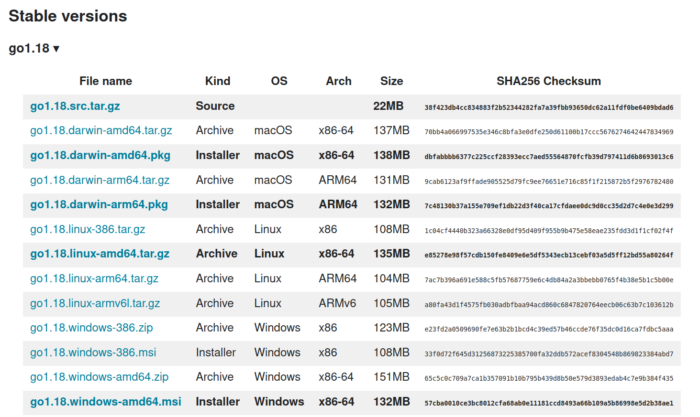

On Windows and MacOS the golang installers are signed by Google so that the operating systems can verify that they have been published by Google.

However, for Linux-based operating systems the binaries are distributed as an archive and their integrity must be checked manually.

The linux binaries for various architectures are found on this page [here](https://go.dev/dl/).

The latest stable version is displayed with a list of released artifacts:



I'm going to install the amd64 artifact so I first download the file with curl:

```shell
$ curl https://go.dev/dl/go1.18.linux-amd64.tar.gz -OL
```

Now you can compare the hash to what is on the website.

```shell
$ sha256sum go1.18.linux-amd64.tar.gz 
e85278e98f57cdb150fe8409e6e5df5343ecb13cebf03a5d5ff12bd55a80264f  go1.18.linux-amd64.tar.gz
```

It matches what was published on the website.

Now, if you trust that this web page and these artifacts are from Google then you can stop here and follow the rest of their instructions for installation.

However, if you want to verify with zero uncertainty that this file and checksum have been published by Google, then you'll want to verify the signature using googles public key.

To be fair, there will always be a very tiny bit of uncertainty since it is possible that Google's private key for signing could have been compromised, but that is a very unlikely possibility.

The signature isn't listed as an artifact but can still be downloaded using the following:

```shell
$ curl https://go.dev/dl/go1.18.linux-amd64.tar.gz.asc -OL
```

Now download and import the google public key to your GPG keyring:

```shell
$ curl https://dl.google.com/dl/linux/linux_signing_key.pub -OL
$ gpg --import linux_signing_key.pub
```

Finally, verify the signature:

```shell
$ gpg --verify go1.18.linux-amd64.tar.gz.asc
gpg: assuming signed data in 'go1.18.linux-amd64.tar.gz'
gpg: Signature made Tue 15 Mar 2022 12:54:40 PM EDT
gpg:                using RSA key 78BD65473CB3BD13
gpg: Good signature from "Google Inc. (Linux Packages Signing Authority) <linux-packages-keymaster@google.com>" [unknown]
gpg: WARNING: This key is not certified with a trusted signature!
gpg:          There is no indication that the signature belongs to the owner.
Primary key fingerprint: EB4C 1BFD 4F04 2F6D DDCC  EC91 7721 F63B D38B 4796
     Subkey fingerprint: 2F52 8D36 D67B 69ED F998  D857 78BD 6547 3CB3 BD13
```

You can ignore the `WARNING` since we haven't signed their public key.
