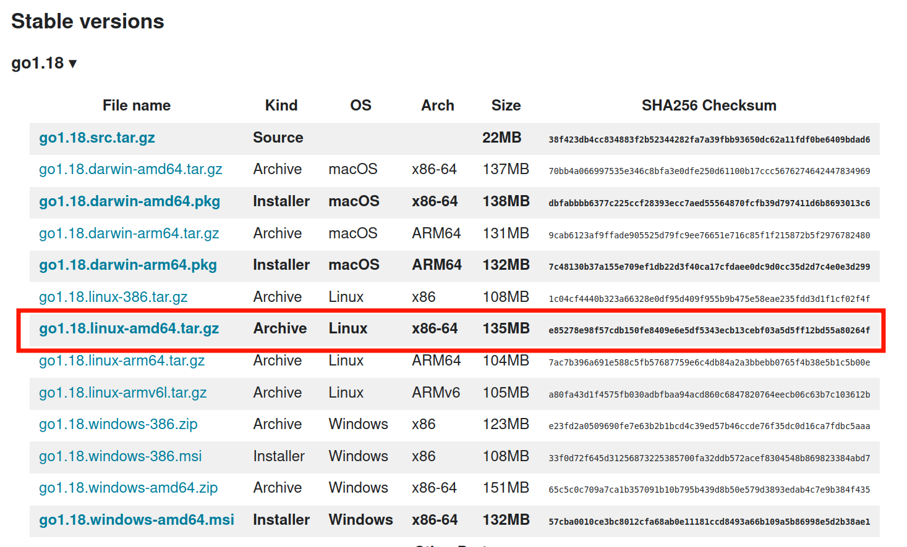

# Securely installing the Go programming language (golang)

On Windows and MacOS the golang installers are signed so that the operating systems can verify that they have been published by Google.

With Linux-based operating systems there are various methods that will depend on the distro you use. For example, [Ubuntu offers snap and apt](https://www.cyberciti.biz/faq/how-to-install-gol-ang-on-ubuntu-linux/) to install specific versions of golang. Other distros have their own software management tools like [yum](https://medium.com/cloud-security/go-get-go-download-install-8b48a0425717).

These software managers will let you install certain releases but not all. If you want to install a newer or different version of golang from a tarball archive then the integrity must be checked manually.

# Installing from tarball archive

The linux installers/archives for various architectures are found on this page [here](https://go.dev/dl/).

The latest stable version 1.18 (as of March 2022) is displayed with a list of released artifacts:



To install the amd64 artifact, first download the file with curl:

```shell
$ curl https://go.dev/dl/go1.18.linux-amd64.tar.gz -OL
```

The `-OL` options will write the file to your disk and handle `3xx` redirect responses.

Now compare the sha256 hash to what is on the website:

```shell
$ sha256sum go1.18.linux-amd64.tar.gz 
e85278e98f57cdb150fe8409e6e5df5343ecb13cebf03a5d5ff12bd55a80264f  go1.18.linux-amd64.tar.gz
```

Looks good!

If you trust that this web page and these artifacts were really published by Google then you can stop here and follow [the rest of their installation instructions](https://go.dev/doc/install).

But if you want to verify with the least uncertainty that this file and checksum have been published by Google, then you'll want to verify the signature using Google's public key.

# Checking the signature on the archive

Verifying the signature on the archive gives us confidence that Google has released this archive for our use.

The signature for the archive isn't listed as an artifact but can still be downloaded by concatenating `.asc` to the filename:

```shell
$ curl https://go.dev/dl/go1.18.linux-amd64.tar.gz.asc -OL
```

Now download and import the google public key to your GPG keyring:

```shell
$ curl https://dl.google.com/dl/linux/linux_signing_key.pub -OL
$ gpg --import linux_signing_key.pub
```

You can list the keys in your keyring with the following:

```shell
$ gpg --list-keys
pub   rsa4096 2016-04-12 [SC]
      EB4C1BFD4F042F6DDDCCEC917721F63BD38B4796
uid           [ unknown] Google Inc. (Linux Packages Signing Authority) <linux-packages-keymaster@google.com>
sub   rsa4096 2019-07-22 [S] [expires: 2022-07-21]
sub   rsa4096 2021-10-26 [S] [expires: 2024-10-25]
```

Note that the fingerprint for their primary public key is `EB4C1BFD4F042F6DDDCCEC917721F63BD38B4796` and that it is set to expire on July 21, 2022. If you are reading this post and it's past that date, make sure to import their latest public key!

The best thing to do is try to find the Google public key from multiple locations to increase the likelihood that it is authentic. Don't trust me!

Finally, verify the signature:

```shell
$ gpg --verify go1.18.linux-amd64.tar.gz.asc
gpg: assuming signed data in 'go1.18.linux-amd64.tar.gz'
gpg: Signature made Tue 15 Mar 2022 12:54:40 PM EDT
gpg:                using RSA key 78BD65473CB3BD13
gpg: Good signature from "Google Inc. (Linux Packages Signing Authority) <linux-packages-keymaster@google.com>" [unknown]
gpg: WARNING: This key is not certified with a trusted signature!
gpg:          There is no indication that the signature belongs to the owner.
Primary key fingerprint: EB4C 1BFD 4F04 2F6D DDCC  EC91 7721 F63B D38B 4796
     Subkey fingerprint: 2F52 8D36 D67B 69ED F998  D857 78BD 6547 3CB3 BD13
```

Note the primary key fingerprint matches above.

You can ignore the `WARNING` since we haven't verified their public key by signing it.

Now you can sleep well at night knowing that you are safe from supply chain attacks on the golang binaries!

Some content for this post came from [this github issue](https://github.com/golang/go/issues/14739).
